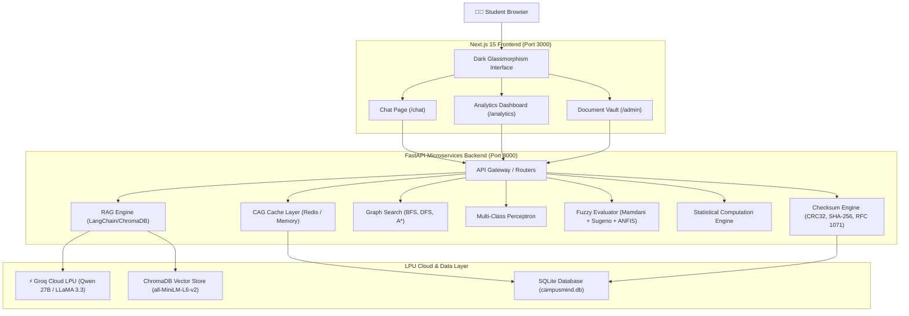

# 🧠 CampusMind — Unified Engineering Microproject

[](https://fastapi.tiangolo.com)
[](https://nextjs.org)
[](https://groq.com)
[](https://trychroma.com)
[](https://docker.com)
[](https://opensource.org/licenses/MIT)

> **CampusMind** is a state-of-the-art, AI-powered Academic RAG Chatbot cross-engineered as a **single unified microproject** that fulfills the practical laboratory curriculum across **5 university subjects**:
> 1. **AISC**: Artificial Intelligence & Soft Computing
> 2. **CN**: Computer Networks
> 3. **Stats**: Applied Statistics
> 4. **WMC**: Wireless & Mobile Computing
> 5. **ASD&D**: Agile Software Development & DevOps

---

## 🎯 System Architecture



---

## 🔬 Subject-Wise Experiment Mapping

| Subject | Experiment | Implemented Feature in CampusMind | Source File |
|---|---|---|---|
| **AISC** | Exp 1: PEAS Model | Intelligent agent formulation & environment classification | [`docs/peas_formulation.md`](docs/peas_formulation.md) |
| **AISC** | Exp 3: Uninformed Search | BFS & DFS traversal of document similarity graph | [`backend/services/search_service.py`](backend/services/search_service.py) |
| **AISC** | Exp 4: Informed Search | A* heuristic search ($f(n) = g(n) + h(n)$) with cosine distance | [`backend/services/search_service.py`](backend/services/search_service.py) |
| **AISC** | Exp 7 & 8: Perceptrons | Binary & Multi-class perceptron for query intent classification | [`backend/ml/perceptron.py`](backend/ml/perceptron.py) |
| **AISC** | Exp 9 & 10: Generative AI | Cloud LPU acceleration using Groq API with streaming | [`backend/services/llm_service.py`](backend/services/llm_service.py) |
| **AISC** | Exp 11: RAG Pipeline | Context-grounded retrieval with ChromaDB vector search | [`backend/services/rag_service.py`](backend/services/rag_service.py) |
| **AISC** | Exp 12: CAG Layer | Cache-Augmented Generation for sub-5ms repeated queries | [`backend/services/cag_service.py`](backend/services/cag_service.py) |
| **AISC** | Exp 13: Fuzzy Controller | Triangular & Trapezoidal membership functions | [`backend/fuzzy/membership_functions.py`](backend/fuzzy/membership_functions.py) |
| **AISC** | Exp 14: Mamdani & Sugeno | Defuzzification quality evaluation scoring | [`backend/fuzzy/mamdani_fis.py`](backend/fuzzy/mamdani_fis.py) |
| **AISC** | Exp 15: Neuro-Fuzzy ANFIS | Hybrid neural gradient learning with fuzzy inference rules | [`backend/fuzzy/neurofuzzy.py`](backend/fuzzy/neurofuzzy.py) |
| **CN** | Exp 1: Network Topology | Architectural topology and multi-tier diagram | [`docs/network_architecture.md`](docs/network_architecture.md) |
| **CN** | Exp 2: PING Health | `/api/health/ping` and `/api/health/services` reachability | [`backend/routers/health.py`](backend/routers/health.py) |
| **CN** | Exp 5: Error Detection | SHA-256, CRC-32, and Internet Checksum RFC 1071 on upload | [`backend/services/checksum_service.py`](backend/services/checksum_service.py) |
| **CN** | Exp 8: Socket Programming | Real-time WebSocket token streaming `/api/chat/ws` | [`backend/routers/chat.py`](backend/routers/chat.py) |
| **CN** | Exp 10: DNS Resolution | Domain name to IPv4/IPv6 socket resolution | [`backend/routers/health.py`](backend/routers/health.py) |
| **Stats** | Exp 1: Descriptive EDA | Mean, Median, Mode, Variance, Std Dev, IQR, Skewness | [`backend/services/stats_service.py`](backend/services/stats_service.py) |
| **Stats** | Exp 4: CLT & Distributions | Sampling distribution analysis on latency metrics | [`backend/routers/analytics.py`](backend/routers/analytics.py) |
| **Stats** | Exp 5: Hypothesis Testing | Welch's two-sample independent t-test (RAG vs CAG) | [`backend/services/stats_service.py`](backend/services/stats_service.py) |
| **Stats** | Exp 8 & 9: Regression | Pearson correlation $r$, $R^2$, and regression $y = mx + c$ | [`backend/services/stats_service.py`](backend/services/stats_service.py) |
| **Stats** | Exp 10: Classification | Multi-class intent distribution tracking | [`backend/routers/analytics.py`](backend/routers/analytics.py) |
| **Stats** | Exp 12: PCA & Clustering | 2D PCA dimensionality reduction and query clustering | [`backend/routers/analytics.py`](backend/routers/analytics.py) |
| **WMC** | Exp 4, 5, 7: Interfaces | Hardware network adapter monitoring, MAC and IP families | [`backend/routers/network.py`](backend/routers/network.py) |
| **WMC** | Wireless Analysis | Electromagnetic spectrum, channel propagation & battery savings | [`docs/wireless_analysis.md`](docs/wireless_analysis.md) |
| **ASD&D**| Exp 1 & 2: Version Control | Conventional Git branching and phased interval commits | Commit history |
| **ASD&D**| Exp 3 & 8: CI/CD Pipeline | Automated GitHub Actions CI and CD workflows | [`.github/workflows/ci.yml`](.github/workflows/ci.yml) |
| **ASD&D**| Exp 4: Containerization | Production multi-stage Dockerfiles and Docker Compose | [`devops/docker-compose.yml`](devops/docker-compose.yml) |
| **ASD&D**| Exp 5 & 7: Orchestration | Kubernetes Deployments, Services, and ConfigMaps | [`devops/kubernetes/`](devops/kubernetes/) |
| **ASD&D**| Exp 6: IaC | Terraform infrastructure definitions | [`devops/terraform/`](devops/terraform/) |
| **ASD&D**| Exp 10: Monitoring | Prometheus metrics collection (`/metrics`) | [`devops/prometheus/`](devops/prometheus/) |
| **ASD&D**| Exp 11: ML Tracking | MLflow parameters, metrics, and run tracking | [`devops/mlflow/`](devops/mlflow/) |
| **ASD&D**| Exp 12: Workflows | Apache Airflow automated document ingestion DAG | [`devops/airflow/dags/`](devops/airflow/dags/) |
| **ASD&D**| Exp 14: Config Mgmt | Ansible automated provisioning playbook and inventory | [`devops/ansible/`](devops/ansible/) |

---

## ⚡ Quick Start

### 1. Prerequisites
- Python 3.10+
- Node.js 18+ and npm
- Free Groq API Key from [console.groq.com/keys](https://console.groq.com/keys)

### 2. Environment Configuration
Create a `.env` file in the root directory (or copy `.env.example`):
```bash
GROQ_API_KEY=gsk_your_groq_api_key_here
GROQ_MODEL=qwen/qwen3.8-27b
HOST=0.0.0.0
PORT=8000
DATABASE_URL=sqlite:///./campusmind.db
REDIS_URL=redis://localhost:6379/0
```

### 3. Run Backend (FastAPI)
```powershell
cd backend
python -m venv venv
.\venv\Scripts\Activate.ps1
pip install -r requirements.txt
uvicorn main:app --reload --port 8000
```
- API Documentation: [http://localhost:8000/docs](http://localhost:8000/docs)
- Health Check: [http://localhost:8000/api/health/ping](http://localhost:8000/api/health/ping)

### 4. Run Frontend (Next.js 15)
```powershell
cd frontend
npm install
npm run dev
```
- Web Application: [http://localhost:3000](http://localhost:3000)
- Academic Chat: [http://localhost:3000/chat](http://localhost:3000/chat)
- Analytics Dashboard: [http://localhost:3000/analytics](http://localhost:3000/analytics)
- Document Vault: [http://localhost:3000/admin](http://localhost:3000/admin)

---

## 🐳 Docker Deployment
To run the full stack via Docker Compose:
```bash
docker compose -f devops/docker-compose.yml up --build -d
```
To run with Prometheus & Grafana monitoring:
```bash
docker compose -f devops/docker-compose.monitoring.yml up -d
```
- Prometheus: `http://localhost:9090`
- Grafana: `http://localhost:3001` (admin / admin)

---

## 📜 License

This project is licensed under the [MIT License](LICENSE) - see the [LICENSE](LICENSE) file for details.

Copyright (c) 2026 Swaraj Kanse.
